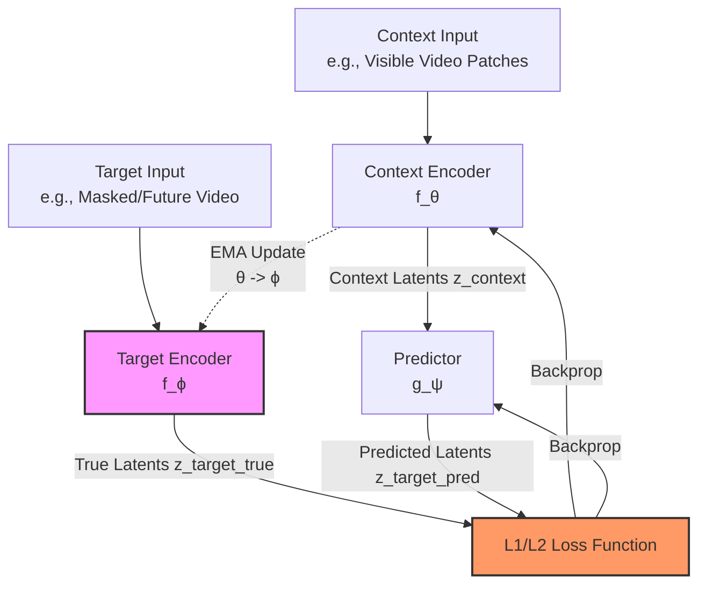

# V-JEPA 2 & 2.1: Joint Embedding Predictive Architecture Analysis

This document provides a comprehensive exploration of Meta FAIR's **V-JEPA 2 / 2.1** (Joint Embedding Predictive Architecture) codebase. JEPA is a self-supervised representation learning framework designed to train video/image encoders by predicting missing information in a **latent representation space** rather than pixel space.

---

## Core Architectural Philosophy

Conventional self-supervised models generally fall into two categories:
* **Contrastive Learning (e.g., SimCLR, MoCo):** Compares full images/videos with augmented views, requiring large batch sizes or memory banks and complex negative-sample strategies to prevent collapse.
* **Generative/Pixel Reconstruction (e.g., MAE, VideoMAE):** Masks sections of the input and requires the model to reconstruct raw pixels. This forces the model to expend high capacity on high-frequency noise (e.g., background ripples, changing lighting conditions) instead of semantic concepts.

**JEPA** solves these limitations by:
1. **Predicting in Feature Space:** The predictor attempts to predict the output of a target encoder given a context encoder's representation of the visible parts.
2. **Preventing Collapse without Negatives:** Uses an asymmetric architecture where the **Target Encoder** is updated via an **Exponential Moving Average (EMA)** of the **Context Encoder's** weights, with no gradients flowing through it.



---

## Source Code & Component Directory Map

All codebase components reside in the [`vjepa2/`](file:///Users/loganchoi/Desktop/vjepa2/vjepa2) directory.

### 1. Model Definitions
* **Context/Target Encoder:** Defined as `VisionTransformer` in:
  * **V-JEPA 2.0:** [`vjepa2/src/models/vision_transformer.py`](file:///Users/loganchoi/Desktop/vjepa2/vjepa2/src/models/vision_transformer.py)
  * **V-JEPA 2.1:** [`vjepa2/app/vjepa_2_1/models/vision_transformer.py`](file:///Users/loganchoi/Desktop/vjepa2/vjepa2/app/vjepa_2_1/models/vision_transformer.py)
* **Predictor:** Defined as `VisionTransformerPredictor` in:
  * **V-JEPA 2.0:** [`vjepa2/src/models/predictor.py`](file:///Users/loganchoi/Desktop/vjepa2/vjepa2/src/models/predictor.py)
  * **V-JEPA 2.1:** [`vjepa2/app/vjepa_2_1/models/predictor.py`](file:///Users/loganchoi/Desktop/vjepa2/vjepa2/app/vjepa_2_1/models/predictor.py)
* **Action Predictor (World Modeling):** [`vjepa2/src/models/ac_predictor.py`](file:///Users/loganchoi/Desktop/vjepa2/vjepa2/src/models/ac_predictor.py) (`ActionPredictor`). Conditioner that uses trajectory actions to predict the next visual features.
* **Attentive Pooler & Classifier:** [`vjepa2/src/models/attentive_pooler.py`](file:///Users/loganchoi/Desktop/vjepa2/vjepa2/src/models/attentive_pooler.py) (`AttentivePooler`, `AttentiveClassifier`). Cross-attention pooling modules used to probe frozen features during downstream evaluation.

### 2. Masking Mechanics
* **3D Mask Generator:** [`vjepa2/src/masks/multiseq_multiblock3d.py`](file:///Users/loganchoi/Desktop/vjepa2/vjepa2/src/masks/multiseq_multiblock3d.py) (`MaskCollator` & `_MaskGenerator`). Generates multi-block spatial-temporal masks to segment video volume into visible (context) and hidden (target) regions.

### 3. Training Scripts & Launchers
* **V-JEPA 2.0 Trainer:** [`vjepa2/app/vjepa/train.py`](file:///Users/loganchoi/Desktop/vjepa2/vjepa2/app/vjepa/train.py)
* **V-JEPA 2.1 Trainer:** [`vjepa2/app/vjepa_2_1/train.py`](file:///Users/loganchoi/Desktop/vjepa2/vjepa2/app/vjepa_2_1/train.py)
* **Distributed Launcher:** [`vjepa2/app/main_distributed.py`](file:///Users/loganchoi/Desktop/vjepa2/vjepa2/app/main_distributed.py) and [`vjepa2/app/main.py`](file:///Users/loganchoi/Desktop/vjepa2/vjepa2/app/main.py)
* **Pre-training Configurations:** [`vjepa2/configs/train/`](file:///Users/loganchoi/Desktop/vjepa2/vjepa2/configs/train) & [`vjepa2/configs/train_2_1/`](file:///Users/loganchoi/Desktop/vjepa2/vjepa2/configs/train_2_1)

### 4. Downstream Evaluation Probes
* **Video/Image Frozen Evaluator:** [`vjepa2/evals/video_classification_frozen/eval.py`](file:///Users/loganchoi/Desktop/vjepa2/vjepa2/evals/video_classification_frozen/eval.py) and [`vjepa2/evals/main.py`](file:///Users/loganchoi/Desktop/vjepa2/vjepa2/evals/main.py).

---

## Key Technical Additions in V-JEPA 2.1

V-JEPA 2.1 introduces a significantly improved training recipe compared to V-JEPA 2.0, focusing on learning highly temporally consistent and dense features.

### A. Deep Self-Supervision (Hierarchical Layer Distillation)
Instead of extracting and supervising only the final layer of representations, V-JEPA 2.1 maps representations across multiple intermediate layers of the encoder model (e.g. 4 distinct depths).
* **Layer Selection:** Defined in the `VisionTransformer` constructor based on the depth parameter:
  * For 12-layer models (ViT-B, ViT-L): Layers `[2, 5, 8, 11]` are supervised.
  * For 24-layer models (ViT-H, ViT-g): Layers `[5, 11, 17, 23]` are supervised.
  * For 40-layer models (ViT-G): Layers `[9, 19, 29, 39]` are supervised.
* **Feature Concatenation in Predictor:** Inside `predictor.py` (`VisionTransformerPredictor`), the encoder's output representations from the selected hierarchical layers are concatenated before being projected:
  ```python
  # If multi-layer hierarchical prediction is active, concatenate them
  self.predictor_embed = nn.Sequential(
      nn.Linear(embed_dim * len(self.hierarchical_layers), embed_dim, bias=True),
      act_layer_mlp(),
      nn.Linear(embed_dim, predictor_embed_dim, bias=True),
  )
  ```
* **Projecting Back:** The predictor maps outputs back to the concatenated target dimensions using `self.predictor_proj` (which projects to `len(self.hierarchical_layers) * out_embed_dim`).

### B. Dense Predictive Loss (`predict_all` / `return_all_tokens`)
In V-JEPA 2.0, loss was calculated solely on predicted target (masked) tokens. In V-JEPA 2.1, training uses **Dense Predictive Loss**, meaning that all tokens—both visible context tokens and masked target tokens—are predicted and contribute to the loss:
* The predictor has a flag `self.return_all_tokens` that, when set to `True`, splits the output into `x_pred` (predictions of masked target positions) and `x_context` (predictions of visible context positions).
* Both components are compared against their respective layer-normalized true representations, forcing the predictor to model the global temporal sequence self-consistently.

### C. Multi-Modal Tokenizers (Images & Videos)
V-JEPA 2.1 is designed to scale dynamically across images and videos:
* **Tokenizers:** Employs `PatchEmbed` for 2D static images and `PatchEmbed3D` (tubelet size of 2) for videos.
* **Modality Embeddings:** Modality embeddings `self.img_mod_embed` and `self.video_mod_embed` are added inside the predictor to condition predictions depending on the input modality:
  ```python
  if self.modality_embedding:
      if mod == "image":
          x += self.img_mod_embed.repeat(B, 1, 1)
      else:
          x += self.video_mod_embed.repeat(B, 1, 1)
  ```

---

## Mask Generation & Token-Alignment Mechanics

The Mask Collator in [`vjepa2/src/masks/multiseq_multiblock3d.py`](file:///Users/loganchoi/Desktop/vjepa2/vjepa2/src/masks/multiseq_multiblock3d.py) generates 3D block-masks. It samples blocks of frame-intervals and spatial regions.

1. **Mask Generation:** `_MaskGenerator` samples target blocks (`masks_pred`) with a specific aspect ratio, spatial scale, and temporal scale. The remaining tokens are filtered to create the context masks (`masks_enc`).
2. **Context Encoding:** The encoder only processes context tokens. Inside `VisionTransformer`, `apply_masks` is called on the input patches to reduce sequence length and save computational budget:
   ```python
   # Apply context masks to input tokens
   x = apply_masks(x, masks_enc)
   ```
3. **Geometry Reconstruction in Predictor:** Inside `predictor.py`, the predictor receives the context representations `x` and targets to predict.
   * Target positions are filled with shared learnable `mask_tokens`.
   * **Positional Index Alignment:** The spatial/temporal coordinates of context and target patches must be preserved. To do this, the predictor concatenates the context tokens and target (mask) tokens and sorts them back into grid-order based on their original 3D indices:
     ```python
     masks = torch.cat([masks_x, masks_y], dim=1)
     argsort = torch.argsort(masks, dim=1)
     # Restore spatial-temporal geometric order
     x = torch.stack([x[i, row, :] for i, row in enumerate(argsort)], dim=0)
     ```
   * The sorted tensor is processed by `self.predictor_blocks` so self-attention layers can model spatial-temporal proximity.

---

## Model Parameters & Training Recipes

### V-JEPA 2.0 Models
| Model Class | Parameter Count | Resolution | Checkpoint | Train Config |
| :--- | :--- | :--- | :--- | :--- |
| **ViT-L/16** | 300M | $256 \times 256$ | [checkpoint](https://dl.fbaipublicfiles.com/vjepa2/vitl.pt) | [configs](file:///Users/loganchoi/Desktop/vjepa2/vjepa2/configs/train/vitl16) |
| **ViT-H/16** | 600M | $256 \times 256$ | [checkpoint](https://dl.fbaipublicfiles.com/vjepa2/vith.pt) | [configs](file:///Users/loganchoi/Desktop/vjepa2/vjepa2/configs/train/vith16) |
| **ViT-g/16** | 1B | $256 \times 256$ | [checkpoint](https://dl.fbaipublicfiles.com/vjepa2/vitg.pt) | [configs](file:///Users/loganchoi/Desktop/vjepa2/vjepa2/configs/train/vitg16) |

### V-JEPA 2.1 Models (Trained with Hierarchical Deep Distillation)
| Model Class | Parameter Count | Resolution | Checkpoint | Train Config |
| :--- | :--- | :--- | :--- | :--- |
| **ViT-B/16** | 80M | $384 \times 384$ | [checkpoint](https://dl.fbaipublicfiles.com/vjepa2/vjepa2_1_vitb_dist_vitG_384.pt) | [configs](file:///Users/loganchoi/Desktop/vjepa2/vjepa2/configs/train_2_1/vitb16) |
| **ViT-L/16** | 300M | $384 \times 384$ | [checkpoint](https://dl.fbaipublicfiles.com/vjepa2/vjepa2_1_vitl_dist_vitG_384.pt) | [configs](file:///Users/loganchoi/Desktop/vjepa2/vjepa2/configs/train_2_1/vitl16) |
| **ViT-g/16** | 1B | $384 \times 384$ | [checkpoint](https://dl.fbaipublicfiles.com/vjepa2/vjepa2_1_vitg_384.pt) | [configs](file:///Users/loganchoi/Desktop/vjepa2/vjepa2/configs/train_2_1/vitg16) |
| **ViT-G/16** | 2B | $384 \times 384$ | [checkpoint](https://dl.fbaipublicfiles.com/vjepa2/vjepa2_1_vitG_384.pt) | [configs](file:///Users/loganchoi/Desktop/vjepa2/vjepa2/configs/train_2_1/vitG16) |

---

## Running Inference & Local Verification

To run inference and extract dense visual representations on a sample video from Hugging Face (`facebook/vjepa2-vitl-fpc64-256`), execute the local validation test script:
```bash
python test_vjepa.py
```
This script will:
1. Download a Kinetics-mini sample video if not locally present ([`sample_video.mp4`](file:///Users/loganchoi/Desktop/vjepa2/sample_video.mp4)).
2. Parse frames using decord.
3. Automatically select the best hardware acceleration (CUDA, Apple Silicon MPS, or CPU).
4. Fetch the V-JEPA 2 model and weights from Hugging Face and print the shape/statistics of the final dense embeddings.

---

## Research & Explorations

We have implemented and completed deep analyses on the following research avenues:

### [Option 1: Dense Feature Visualization and PCA-based Temporal Tracking](./option1/README.md)
* **Goal**: Probing the latent space representations of V-JEPA 2.1 by projecting 1024-D token features onto 3-component PCA (RGB) color spaces to track semantic parts across frame transformations.
* **Findings**:
  * **Temporal Continuity**: Global SVD locked coordinate projections yield highly stable, smooth tracking overlays, demonstrating V-JEPA's strength in video dynamics compared to pure per-frame spatial models.
  * **Transformer Contextual Leakage**: We mapped and explained how Self-Attention causes slight background representation ripples as the foreground bowler moves.
  * **Stability Analysis**: We introduced quantitative **Flicker Maps (Temporal Variance)** and **Feature Trajectory Plots** comparing stable global coordinate projections vs. chaotic per-frame projections.
* Refer to the dedicated [Option 1 README](./option1/README.md) for full methodologies, visual results, and execution guides.
