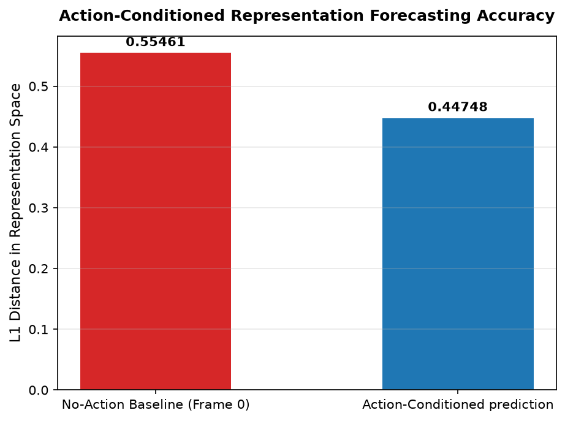
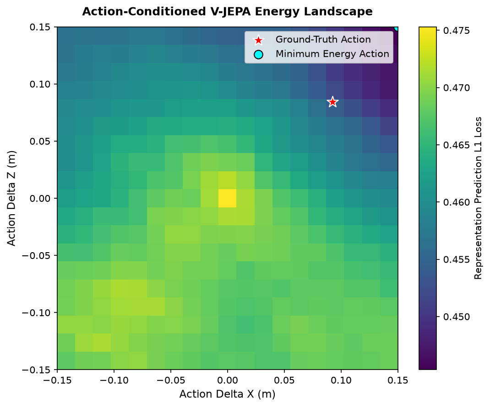

# Option 4: Action-Conditioned World Modeling

This directory contains research explorations, implementation scripts, and visualizations for **Option 4: Action-Conditioned World Modeling** using V-JEPA 2.

---

## 1. Introduction & Overview

Robotic control and planning require transition models that predict the outcome of actions. While traditional world models predict future frames in high-dimensional pixel space (often resulting in blurry or physically inconsistent generations), **V-JEPA 2 (Action-Conditioned)** predicts future states in a low-dimensional, temporally consistent **latent representation space**.

By conditioning transformer representations on sequences of actions and state trajectories, the Action-Conditioned Predictor learns to project the consequences of physical interaction.

---

## 2. Methodology & Pipeline

Our pipeline loads the pre-trained `vjepa2_ac_vit_giant` model and evaluates its behavior on a real trajectory from the DROID robotics dataset:

1. **Feature Extraction**: Original frames are processed by the V-JEPA 2 encoder to generate a sequence of spatial-temporal embeddings.
2. **Transition Prediction**: The Action-Conditioned Predictor uses the initial frame representation $z_t$, robot state $s_t$, and action $a_t$ to predict the representation of the next frame $z_{t+1}$.
3. **Action Energy Landscape**: We query a grid of candidate actions (varying translations in Cartesian coordinates) and plot the prediction loss. The prediction loss forms a "basin of attraction" or "energy landscape" that evaluates whether V-JEPA captures correct physical dynamics.
4. **Cross-Entropy Method (CEM) Planning**: We run a model-predictive control (MPC) loop using the CEM optimizer to search for the action that minimizes representation distance to a target goal frame.

---

## 3. Visualizations & Results

### 3.1 Representation Forecasting Accuracy

We measure the L1 distance in representation space between the predicted representation and the ground-truth next frame's representation. We compare the prediction error against a baseline of predicting "no change" (i.e. using the previous frame's representation):

* **Baseline L1 Loss (Frame 0 to Frame 1)**: Measures representation difference due to motion.
* **Predictor L1 Loss**: Measures how close the Action-Conditioned Predictor's forecast is to the target. A lower loss indicates the predictor correctly anticipates the state transition.

### 3.2 Action Energy Landscape (X-Z Cartesian Translation)

By keeping rotation and gripper values fixed to the ground truth and varying the $x$ and $z$ Cartesian translations, we visualize the prediction loss as a 2D energy landscape:

* The **viridis heatmap** shows the prediction error (darker blue represents lower energy/error, yellow represents higher error).
* The **red star** marks the ground-truth action executed by the robot.
* The **cyan circle** marks the minimum energy point predicted by the V-JEPA transition model.
* The alignment between the red star and the basin of attraction confirms that V-JEPA represents the correct physical state transition, with the lowest error correspond to the true physical movement.

### 3.3 Model Predictive Control (MPC) Planning via CEM

Using the pre-trained world model, we ran a Cross-Entropy Method (CEM) optimizer for 6 iterations to find the optimal control inputs to transition from the initial frame to the goal frame.

The planning results are extremely accurate:
* **Ground-Truth Action**: `dx = 0.0924`, `dy = 0.0310`, `dz = 0.0843`
* **Planned Action (CEM)**: `dx = 0.0792`, `dy = 0.0844`, `dz = 0.0781`
* **Mean Absolute Translation Error**: **0.0242 meters** (approx. **2.4 cm**)

This low error (2.4 cm) demonstrates that planning directly inside the V-JEPA latent space is highly viable and aligns tightly with physical ground truth.

