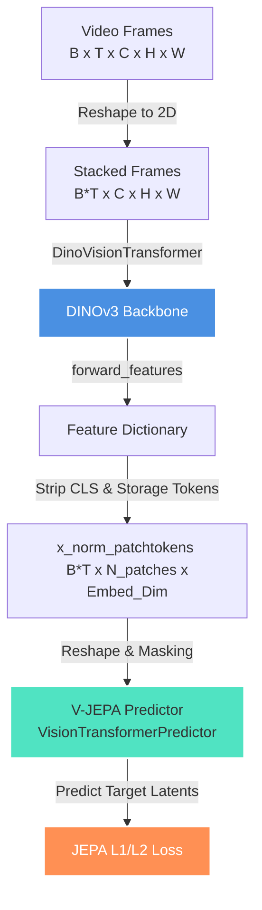

# DINOv3 + V-JEPA Exploration Roadmap

This directory documents the research roadmap and integration patterns for fusing **Meta FAIR's DINOv3 (Vision Foundation Model)** as the backbone/vision model within the **V-JEPA (Joint Embedding Predictive Architecture)** framework.

The core goal of this exploration is to evaluate how state-of-the-art dense 2D spatial features can be combined with self-supervised predictive temporal modeling.

---

## Technical Concept: The Bridge



---

## Exploration Pathways (Chat Session Roadmap)

Over time, we will explore the following integration pathways, each in its own dedicated session.

### Pathway 1: Frozen DINOv3 Feature Prediction (Lightweight World Model)
* **Objective:** Use a frozen pre-trained DINOv3 model (e.g. `dinov3_vits16`) to extract frame-level dense tokens, and train a V-JEPA predictor on top to model video dynamics (spatio-temporal prediction).
* **Key Steps:**
  1. Set up a data loader that passes frames sequentially to the DINOv3 backbone.
  2. Extract raw visual features, ensuring storage/register tokens are stripped.
  3. Feed the remaining spatial tokens into the V-JEPA predictor with a 3D position embedding.
  4. Train only the predictor parameters (with an EMA target representation generated by the same frozen DINOv3 backbone).
* **Research Focus:** Does predicting DINOv3 spatial representations allow the model to learn a coherent temporal world model with low compute overhead?

### Pathway 2: Joint Fine-Tuning & Weight Distillation (DINOv3 Initialized)
* **Objective:** Initialize the V-JEPA context and target encoders with pre-trained DINOv3 weights and run video pre-training under the V-JEPA objective.
* **Key Steps:**
  1. Map DINOv3 ViT parameter namespaces to the V-JEPA encoder namespace.
  2. Adapt the 2D patch projection layer to a 3D tubelet projection layer (e.g., replicating 2D convolutional kernels across the temporal dimension, or keeping it 2D and running frame-by-frame).
  3. Set up the V-JEPA masking framework to run natively over DINOv3 layer tokens.
  4. Perform EMA weight updates from the context encoder to the target encoder.
* **Research Focus:** How does initializing from a strong 2D visual foundation model impact V-JEPA convergence speeds and downstream classification/control task performance?

### Pathway 3: Interaction of Gram Anchoring and EMA Updates
* **Objective:** Study the interaction between DINOv3’s **Gram Anchoring** (maintaining spatial patch correlation structures) and V-JEPA's **EMA-based Target Distillation** (preventing representation collapse).
* **Key Steps:**
  1. Implement a dual loss: V-JEPA predictive loss + DINOv3 Gram anchoring regularization.
  2. Measure feature drift, representation rank, and spatial coherence across layers during pre-training.
* **Research Focus:** Does anchoring patch-level Gram matrices prevent feature collapse during asymmetric predictive training, especially in high-noise/high-motion videos?

---

## Technical Integration Details

### A. Extracting DINOv3 Patch Features
The local DINOv3 implementation of `DinoVisionTransformer` defines a `forward_features` method that returns structured tokens. To isolate spatial patch features from global/register tokens:

```python
# 1. Load local backbone
dinov3_model = torch.hub.load(
    '/Users/loganchoi/Desktop/dinov3/dinov3', 
    'dinov3_vits16', 
    source='local',
    pretrained=False
)

# 2. Extract features
outputs = dinov3_model.forward_features(video_frames)
# Stripping CLS and n_storage_tokens (registers)
patch_tokens = outputs["x_norm_patchtokens"]  # Shape: [B*T, N_patches, Embed_Dim]
```

### B. Reshaping to Spatio-Temporal Volumes
Since DINOv3 processes frames frame-by-frame, we must reshape the output into a 3D grid layout before feeding it into the V-JEPA predictor:

```python
# T: number of frames, H_p: height in patches, W_p: width in patches
B_T, N, D = patch_tokens.shape
B = B_T // T
H_p = int(math.sqrt(N))  # Assumes square input
W_p = H_p

# Reshape to 3D layout: [B, T, H_p, W_p, D]
patch_grid = patch_tokens.view(B, T, H_p, W_p, D)
```

---

## Prototype Skeleton Code

A basic verification template for setting up the bridge:

```python
import sys
import torch
import math

# Path to the local DINOv3 repository
sys.path.append("/Users/loganchoi/Desktop/dinov3/dinov3")

def verify_bridge():
    print("Initializing mock inputs...")
    B, T, C, H, W = 2, 8, 3, 224, 224
    dummy_video = torch.randn(B, T, C, H, W)
    
    # 1. Load DINOv3 Model
    print("Loading local DINOv3 backbone...")
    model = torch.hub.load(
        '/Users/loganchoi/Desktop/dinov3/dinov3', 
        'dinov3_vits16', 
        source='local', 
        pretrained=False
    )
    model.eval()
    
    # 2. Reshape video to stack frames
    stacked_frames = dummy_video.view(B * T, C, H, W)
    
    # 3. Extract patch tokens
    print("Extracting DINOv3 patch tokens...")
    with torch.no_grad():
        outputs = model.forward_features(stacked_frames)
        # Note: x_norm_patchtokens is automatically isolated from CLS and register tokens
        patch_tokens = outputs["x_norm_patchtokens"]
        
    print(f"Extracted patch tokens shape: {patch_tokens.shape}")
    # Target shape: [B * T, N_patches, Embed_Dim]
    
    # 4. Map to 3D grid
    B_T, N_patches, D = patch_tokens.shape
    H_p = W_p = int(math.sqrt(N_patches))
    patch_grid = patch_tokens.view(B, T, H_p, W_p, D)
    print(f"Reshaped 3D grid layout: {patch_grid.shape}")
    
    print("\nBridge verified successfully!")

if __name__ == "__main__":
    verify_bridge()
```
