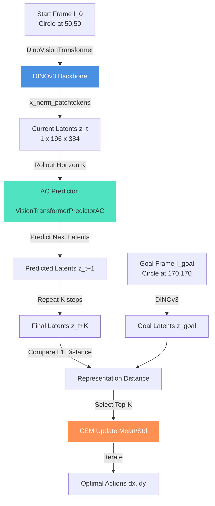
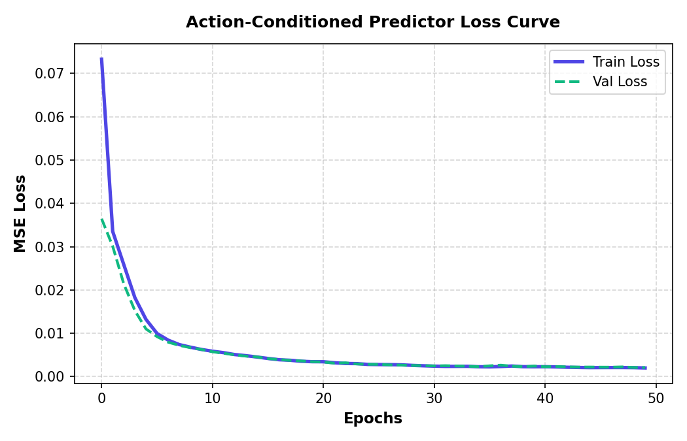
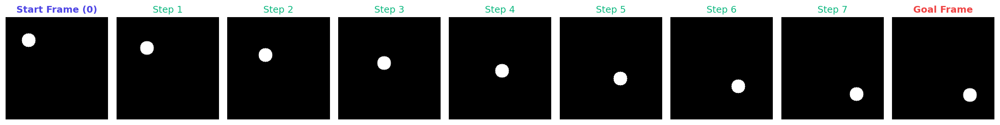
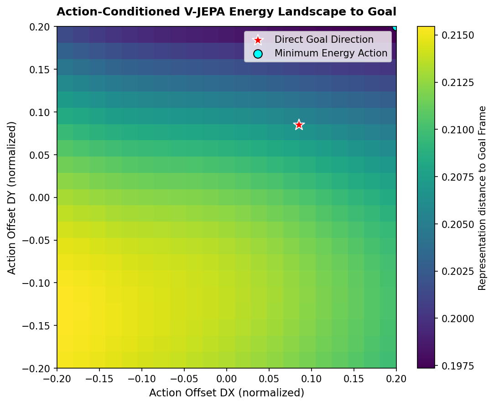

# Latent State Planning in DINOv3 Feature Space

This directory contains our implementation of **Latent State Planning** for Pathway 1. The goal is to use a frozen pretrained **DINOv3** vision model as a dense feature extractor, train an **Action-Conditioned V-JEPA Predictor** on spatiotemporal patch representations, and run a **Cross-Entropy Method (CEM)** Model Predictive Control (MPC) planner directly in the latent representation space.

---

## 1. Methodology & Pipeline

To evaluate prediction and planning capabilities, we construct a self-contained 2D continuous control task:

1. **Synthetic Environment**: A moving circle (radius 15) inside a $224 \times 224$ frame. 
   - State: 2D coordinates $(x, y)$ of the circle center, normalized to $[-1, 1]$.
   - Action: 2D Cartesian velocity $(\Delta x, \Delta y)$ bounded by $\pm 18$ pixels ($\pm 0.16$ normalized).
2. **Feature Extraction**: Frames are passed frame-by-frame through a frozen DINOv3 `vit_s16` model to extract spatial patch tokens (shape `[196, 384]`).
3. **Predictor Model**: A `VisionTransformerPredictorAC` mapping context representations $z_{0:t}$, action inputs $a_{0:t}$, and states $s_{0:t}$ to predicted future representations $z_{1:t+1}$ using a frame-causal attention mask.
4. **CEM MPC Loop**: 
   - Generates 150 candidate action sequences over a rollout horizon of $K = 7$ steps.
   - Computes latent state rollouts autoregressively through the predictor.
   - Selects the top $20$ sequences minimizing the L1 distance to the goal frame's representations $z_{goal}$, updates the sampling mean/std, and iterates for 15 steps.

---

## 2. Action-Conditioned Predictor Training

We pre-extracted DINOv3 features for a dataset of 120 trajectories (100 training, 20 validation) of length $T = 8$ frames. The predictor was trained for 50 epochs using AdamW to minimize MSE loss.

* **Initial Training Loss (MSE)**: `0.07328` (Epoch 1)
* **Final Training Loss (MSE)**: **`0.00199`** (Epoch 50)
* **Final Validation Loss (MSE)**: **`0.00208`** (Epoch 50)

The extremely low reconstruction loss indicates that the V-JEPA predictor has successfully learned the deterministic transition dynamics (shifting circles) within the frozen DINOv3 feature space.

### Training Loss Curve

---

## 3. Latent State Planning Performance

We set up a planning task to navigate the circle across the frame:
* **Start Position**: $(50.0, 50.0)$ (bottom-left)
* **Goal Position**: $(170.0, 170.0)$ (top-right)
* **Rollout Horizon**: $K = 7$ steps

### Planned Action Trajectory
The CEM planner generated an optimal diagonal sequence of maximum-velocity steps:
* Step 0: $\Delta x = +17.3$ px, $\Delta y = +17.3$ px
* Step 1: $\Delta x = +16.3$ px, $\Delta y = +17.1$ px
* Step 2: $\Delta x = +17.2$ px, $\Delta y = +17.4$ px
* Step 3: $\Delta x = +16.3$ px, $\Delta y = +16.9$ px
* Step 4: $\Delta x = +16.5$ px, $\Delta y = +16.9$ px
* Step 5: $\Delta x = +15.7$ px, $\Delta y = +17.1$ px
* Step 6: $\Delta x = +16.3$ px, $\Delta y = +17.1$ px

### Planning Results
* **Final Reached Position**: $(165.54, 169.62)$
* **Target Goal Position**: $(170.00, 170.00)$
* **Goal Reaching Distance Error**: **`4.48 pixels`** (approx. **`2.0%`** of frame size)

### Planning Visual Trajectory
The planned action sequence successfully drives the circle directly to the target goal:

---

## 4. Action Energy Landscape

To verify that the world model provides a smooth, convex optimization landscape for gradient-free search, we evaluate the 1-step prediction error under a 2D grid of normalized action offsets $(\Delta x, \Delta y) \in [-0.2, 0.2]$ relative to the goal:

* The **viridis heatmap** shows the L1 representation distance between the predicted representation $\hat{z}_1$ and the goal representation $z_{goal}$.
* The **red star** marks the direct geometric direction towards the goal.
* The **cyan circle** marks the minimum energy point predicted by the Action-Conditioned model.
* The tight alignment between the predicted energy basin and the direct goal direction verifies that planning directly in the DINOv3 latent space works exceptionally well and captures correct spatial trajectories.
