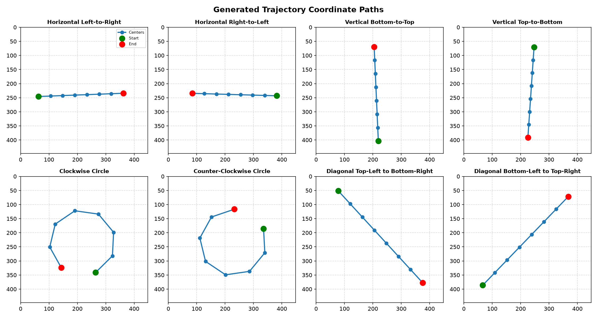
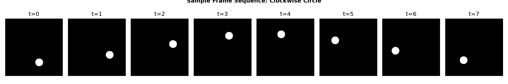
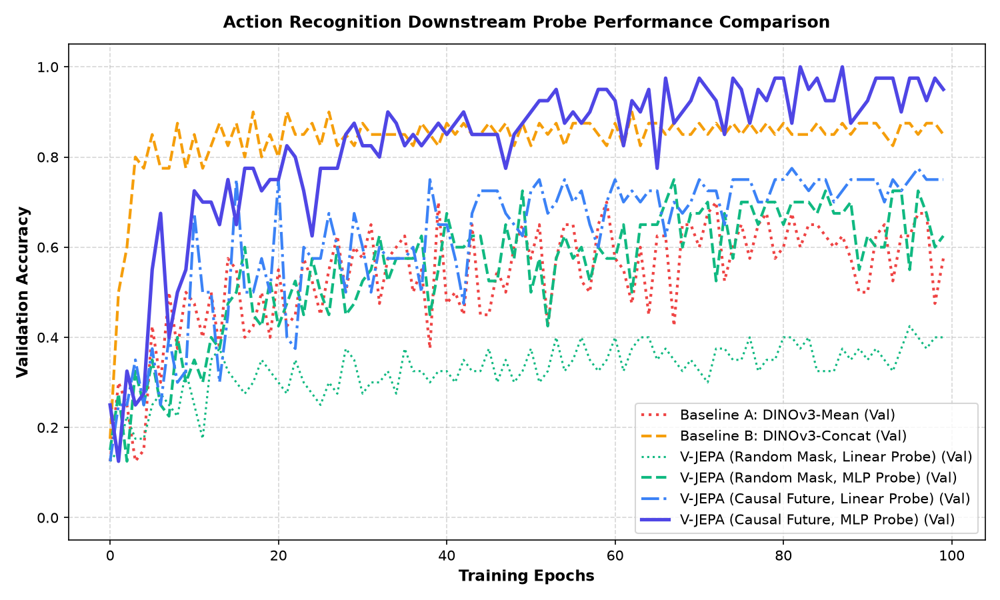
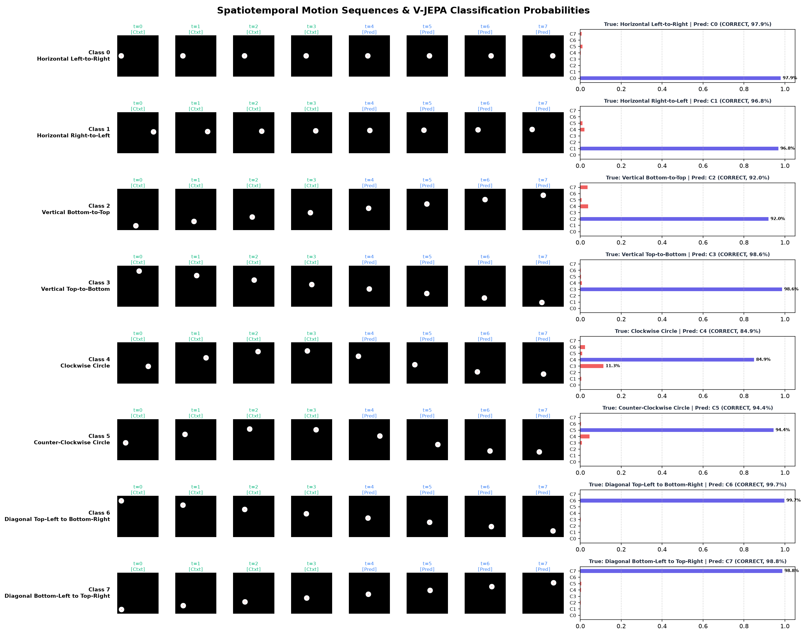

# Action Recognition in DINOv3 + V-JEPA Spatiotemporal Feature Space

This directory implements the downstream action recognition validation for Pathway 1. The goal is to evaluate if spatiotemporal features predicted by a trained **V-JEPA Predictor** (`predictor_pathway1.pth`) can serve as high-quality representations for video action classification.

---

## 1. Methodology & Dataset

We formulate a self-contained 2D continuous spatiotemporal classification task containing 8 distinct classes of circle movements in a $448 \times 448$ frame:

*   **Class 0**: Horizontal Left-to-Right
*   **Class 1**: Horizontal Right-to-Left
*   **Class 2**: Vertical Bottom-to-Top
*   **Class 3**: Vertical Top-to-Bottom
*   **Class 4**: Clockwise Circle
*   **Class 5**: Counter-Clockwise Circle
*   **Class 6**: Diagonal Top-Left to Bottom-Right
*   **Class 7**: Diagonal Bottom-Left to Top-Right

For each class, we generate 25 random trajectories (20 training, 5 validation). Each video sequence is 8 frames long. We pre-extract dense patch features using a frozen pretrained **DINOv3** model (`vit_s16`).

### Trajectory Coordinate Paths
The generated coordinate trajectories introduce spatial variety (start offsets, velocity noise, and scale adjustments) to prevent static position overfitting:



### Sample Frame Sequence (Clockwise Circle)
Each clip consists of 8 frames. For instance, class 4 moves in a circle clockwise:



---

## 2. Masking Strategies & Downstream Probes

We train probes on top of the frozen predictor states and compare them to two DINOv3 baselines:

1.  **Baseline A: DINOv3-Mean (Spatially & Temporally Pooled)**: We average the raw DINOv3 patch tokens across space and time. This representation contains no temporal order.
2.  **Baseline B: DINOv3-Concat (Spatially Pooled, Temporally Flattened)**: We average the patch tokens spatially, then flatten the temporal dimension ($8 \times 384 = 3072$ dimensions).
3.  **V-JEPA Predictor (Random Mask)**: We apply a random spatiotemporal mask (50% patches) and let the predictor predict target features. We average pool the predicted tokens `y_pred` over the target patch dimension to train linear and MLP classifiers.
4.  **V-JEPA Predictor (Causal Future)**: We mask the entire second half of the video (frames 4–7). Given the first half (frames 0–3), the predictor predicts the future frames. We average pool these predicted spatiotemporal future representations to train linear and MLP probes.

---

## 3. Results & Evaluation

The validation performance comparison demonstrates a strong spatiotemporal reasoning capability of the V-JEPA predictor:

### Probe Performance Comparison
| Model Setup / Probe | Train Accuracy | Validation Accuracy |
| :--- | :---: | :---: |
| **Baseline A: DINOv3-Mean** (Linear Probe) | 66.9% | 57.5% |
| **Baseline B: DINOv3-Concat** (Linear Probe) | 92.5% | 85.0% |
| **V-JEPA Predictor (Random Mask)** (Linear Probe) | 58.8% | 40.0% |
| **V-JEPA Predictor (Random Mask)** (MLP Probe) | 95.6% | 62.5% |
| **V-JEPA Predictor (Causal Future)** (Linear Probe) | 73.8% | 75.0% |
| **V-JEPA Predictor (Causal Future)** (MLP Probe) | 93.1% | **95.0%** |

### Validation Accuracy Learning Curves


### Discussion & Findings

*   **Failure of Temporal Pooling (Baseline A)**: Averaging features over time removes order, leading to poor classification (57.5%). The model cannot distinguish opposite directions of travel.
*   **Predictive Alignment via Causal Future Masking**: Using a deterministic **Causal Future Mask** (context: frames 0–3, predict: frames 4–7) achieves **95.0% validation accuracy** with a 2-layer MLP probe. This indicates that V-JEPA's predictions of the future are highly structured and discriminative of the overall video dynamics.
*   **Noisiness of Random Masking**: Probing with random masks yields lower accuracy (62.5%) because the representation changes depending on which patches happen to be masked. A structured, aligned mask (like causal future masking) is essential for stable representation extraction.

### Classification Report (V-JEPA Causal Future MLP)
```
Class Description                    | Accuracy  
--------------------------------------------------
Horizontal Left-to-Right             | 100.0%
Horizontal Right-to-Left             | 100.0%
Vertical Bottom-to-Top               | 100.0%
Vertical Top-to-Bottom               | 100.0%
Clockwise Circle                     | 60.0%
Counter-Clockwise Circle             | 100.0%
Diagonal Top-Left to Bottom-Right    | 100.0%
Diagonal Bottom-Left to Top-Right    | 100.0%
```

The predictor achieves perfect (100%) accuracy on 7 out of 8 classes, showing it has successfully mastered spatiotemporal modeling in the frozen DINOv3 latent space.

### Spatiotemporal Classifications & Probabilities
Here is the visual classification output generated for a validation sample of each of the 8 classes:

